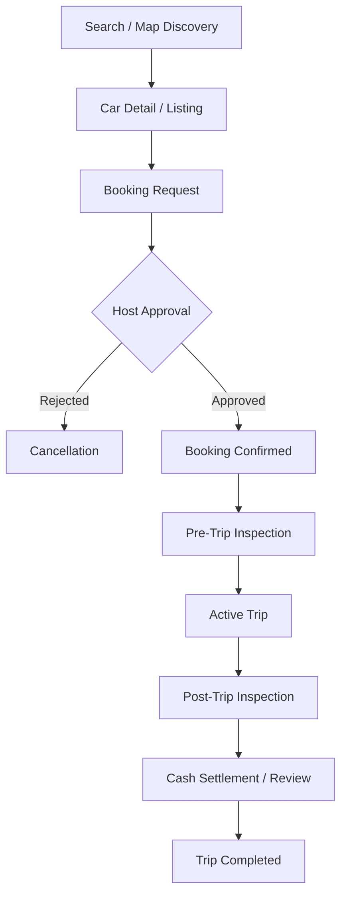

# RozRides 🚗

**RozRides** is a comprehensive, peer-to-peer car rental platform tailored for Pakistan. It seamlessly connects car owners (hosts) with individuals looking to rent vehicles, providing a robust ecosystem for browsing, booking, messaging, and managing rentals.

---

## 🌟 Key Features

### For Renters
*   **Map-Based Search & Discovery**: Find available cars nearby using interactive maps (powered by Google Maps & Geolocator).
*   **Detailed Listings**: View car details, high-quality images, pricing breakdowns, and host reviews.
*   **Seamless Booking**: Easy booking flow with real-time availability and transparent pricing (including cash settlements).
*   **Trip Management**: Comprehensive trip lifecycle management including:
    *   **Pre-Trip & Post-Trip Inspections**: Mandatory photo inspections to ensure vehicle safety.
    *   **Active Trip Tracking**: Real-time status updates during the rental period.
    *   **Damage Claims**: Integrated system for reporting and managing vehicle damage.
*   **In-App Messaging**: Communicate directly with hosts securely within the app via real-time chat.
*   **Reviews & Ratings**: Build community trust with a robust rating system.

### For Hosts (Car Owners)
*   **Easy Listing Management**: Add new vehicles with detailed specs, set locations using a map picker, and manage availability.
*   **Booking Dashboard**: Review incoming requests, accept/decline bookings, and track upcoming reservations.
*   **Asset Protection**: Mandatory inspection flows and automated damage claim flagging.
*   **Earnings & Performance**: Track completed bookings and manage cash settlements efficiently.

### Admin Panel (Web)
*   **User & Listing Management**: Full overview of users, CNIC verifications, and vehicle listings.
*   **Dispute Resolution**: Handle flagged trips, damage claims, and booking cancellations.
*   **Platform Health**: Tools to monitor activity, approve/reject user roles, and ban misbehaving accounts.

---

## 🛠 Tech Stack

### Mobile Application (Flutter)
*   **Framework**: [Flutter](https://flutter.dev/) (Dart)
*   **State Management**: `Provider` for reactive UI updates.
*   **Backend**: Firebase (Auth, Cloud Firestore, Cloud Storage).
*   **Mapping**: `google_maps_flutter`, `geolocator`, `geoflutterfire_plus`.
*   **Utilities**: `intl`, `cached_network_image`, `url_launcher`, `google_fonts`.

### Admin Portal (Next.js)
*   **Framework**: [Next.js](https://nextjs.org/) (TypeScript/React).
*   **Backend Integration**: Firebase Admin SDK (serverless API routes).
*   **Styling**: Modern, responsive dashboard layouts.

---

## 🗺 System Architecture (Graphify Insights)

Our project architecture is analyzed and visualized using **Graphify**. The system is composed of **908 nodes** and **1103 edges**, organized into functional communities.

### Booking Lifecycle Flow


### Core Abstractions
*   **Providers**: `AuthProvider`, `BookingProvider`, `ChatProvider`, `ListingProvider` - These act as the glue between the UI and services.
*   **Services**: `AuthService`, `BookingService`, `ListingService`, `ChatService` - Encapsulate Firebase logic.
*   **Models**: Strong typing with `UserModel`, `BookingModel`, `ListingModel`, `InspectionModel`, etc.

---

## 🚀 Getting Started

### Prerequisites
*   [Flutter SDK](https://docs.flutter.dev/get-started/install) (latest stable version).
*   [Node.js](https://nodejs.org/) (for the Admin Panel).
*   A Firebase project with Auth, Firestore, and Storage enabled.

### Installation

1.  **Clone & Install Mobile App**:
    ```bash
    git clone https://github.com/alik12333/rozridesBU.git
    cd rozridesBU
    flutter pub get
    ```
2.  **Configure Firebase**:
    Place `google-services.json` (Android) and `GoogleService-Info.plist` (iOS) in the appropriate directories.
3.  **Run Mobile App**:
    ```bash
    flutter run
    ```
4.  **Setup Admin Panel**:
    ```bash
    cd admin_panel
    npm install
    # Configure .env.local with Firebase credentials
    npm run dev
    ```

---

## 📂 Project Structure

```text
rozridesBU/
├── lib/
│   ├── core/         # Theming (app_theme.dart), constants, and shared utilities.
│   ├── models/       # Data models (UserModel, BookingModel, etc.) with serialization.
│   ├── providers/    # Provider classes for global state management.
│   ├── screens/      # Feature-based UI screens:
│   │   ├── booking/  # Summary, Details, Confirmation, Cancellation.
│   │   ├── host/     # Request management, Location picker.
│   │   ├── trip/     # Inspections, Active Trip, Settlement.
│   │   └── search/   # Map-based discovery.
│   └── services/     # API/Firebase wrappers for Auth, Bookings, Chat, etc.
├── admin_panel/      # Next.js web portal for administration.
└── graphify-out/     # Automated code graph analysis and reports.
```

---

## 🤝 Contributing
1. Fork the repo.
2. Create a feature branch.
3. Submit a Pull Request.

## 📄 License
Proprietary - All rights reserved.

---
*Generated & maintained with ❤️ by the RozRides Team.*
